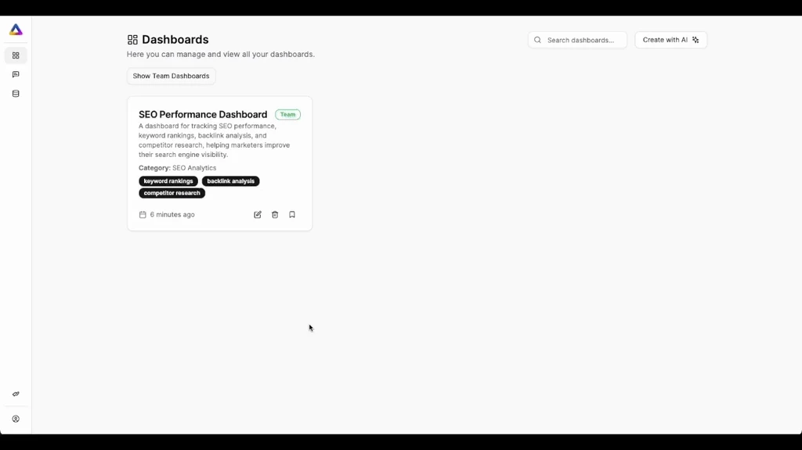
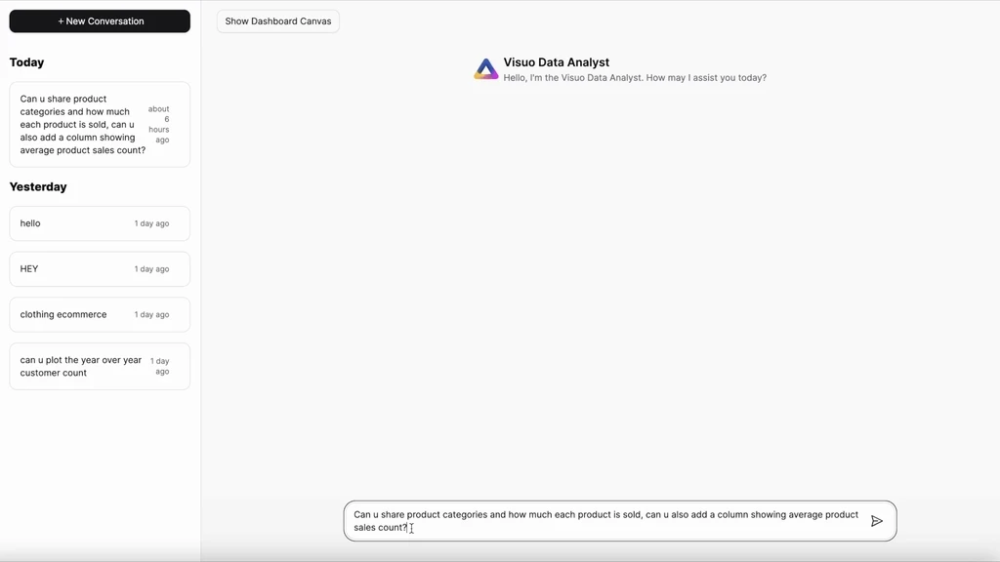
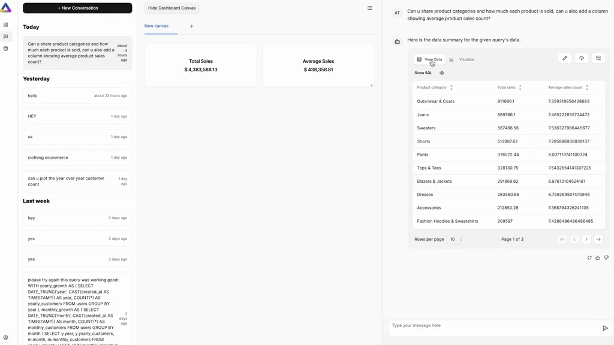
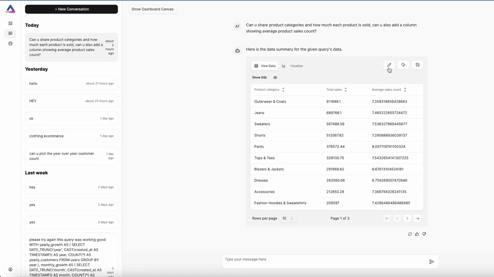

# What's New

We're pushing updates to the platform regularly, so make sure to come back often to see what's changed.

## Enhanced Data Management and Interface Improvements 🚀

October 4, 2024

We're excited to announce our latest update, bringing you improved data management capabilities and a cleaner interface:

- **Download Full Dataset**: We've enabled a button to download the full dataset, making data export easier than ever.
- **Hide Tables in Datasource**: You can now hide tables in the datasource for a cleaner, more focused interface.
- **Enhanced Validation**: We've improved validation for sample data & descriptions when creating a mapping.
- **Collapsible Comments Box**: Comments are now collapsible when in comment mode, providing a tidier workspace.

These updates are designed to streamline your workflow and enhance your data management experience. Enjoy the new features!

## Chat-Based AI Interaction and Version Management 🤖

September 15, 2024

This update brings exciting new ways to interact with our AI and manage your data:

- **Chat-Based AI Interface**: Interact with AI agents through a chat interface, supporting various artifact types.
- **Version Management**: View and manage different versions of mapped data directly inside the spreadsheet.

These features open up new possibilities for AI-assisted data analysis and version control. We can't wait to see how you'll use them!

## Enhanced Data Management and Visualization 📊

August 1, 2024

Our latest update focuses on improving your data management experience:

- **Datasource Browser**: Easily manage your data with our integrated datasource browser.
- **Mapped Data Pagination**: Navigate through large datasets with ease using our new pagination feature.
- **Template Management**: Dedicated section for template management, now with API support.
- **Full-Screen Mode**: Get a better view of your mapped data with our new full-screen mode.
- **Improved Artifact Rendering**: Enhanced artifact rendering in the chat interface for better visualization.
- **CSV Parsing Improvements**: Our CSV parser can now handle empty CSVs with just headers.

## BigQuery Connector is Here 🔗

Jul 1, 2024

Introducing our BigQuery connector!

Unlock the power of your BigQuery data with Visuo.ai's natural language querying and visualization. Connect in just a few clicks and start exploring your data like never before.

Here's how to get started:

1. Navigate to the "Connections" section in your Visuo.ai dashboard.
2. Click "Add a new data source" and select "BigQuery" from the options.
3. Enter your BigQuery credentials (Project ID and Service Account Key).
4. Hit "Next" to finalize the connection.

That's it! You're now ready to query and visualize your BigQuery data using natural language.

Want to learn more? Check out our detailed BigQuery guide at Visuo Documentation Page for advanced tips and best practices.

## Team Dashboards: Collaborate with Your Team🫱🏼‍🫲🏾

Jun 3, 2024

Create dashboards with team visibility effortlessly! No more exporting and sharing dashboards via links, emails, or attachments. Visuo allows you to create dashboards within your team easily, enhancing collaboration. You can manage dashboard visibility, ensuring that only authorized team members have access. Additionally, you can revoke visibility whenever needed, maintaining control over your data.

New Features:

-   Expand/Shrink Dashboard View: Perfect for adjusting to wide screens, providing a more flexible and adaptable dashboard experience.
-   Improved Dashboard UI: We have refined the dashboard user interface for a more intuitive and visually appealing experience.
-   Filter and unfilter dashboards directly from the dashboards view for a more streamlined experience.

## Starting June with Something New: MySQL Connector is Here🔌

Jun 1, 2024

Introducing our MySQL connector! You can now connect to your MySQL database within just a few clicks and start querying and visualizing your data using natural language. Here's how:

1. Navigate to the "Connections" section.
2. Add a new data source and choose "MySQL."
3. Enter your database credentials.
4. Hit "Next" and you're all set!🚀

For more detailed information on connecting and using MySQL with Visuo.ai, please visit our official documentation at https://docs.visuo.ai/guides/mysql

## Just Released: Copy to Clipboard & Download CSV 📋

May 24, 2024

Visuo now supports two highly anticipated features: Copy to Clipboard and Download CSV! We are excited to introduce these additions designed to enhance your data sharing and portability capabilities. With these features, you can effortlessly share and utilize your data across different platforms.

Key Features:

-   Copy to Clipboard: Instantly copy your data insights directly to the clipboard, making it easier to paste and share your data in various applications and documents.
-   Download CSV: Export your data insights as CSV files with a single click. This feature allows you to download your data for further analysis, reporting, or integration with other tools.

## New Feature Alert: Customize Charts 📊

May 22, 2024

Visuo now supports the exciting new Customize Charts feature! We are thrilled to introduce this highly anticipated addition designed to enhance your data visualization and presentation capabilities. With Customize Charts, you can modify AI-generated responses and create personalized charts for your dashboards.

Key Features:

-   Chart Title Customization: Now you can change the title of your charts to better reflect the data being presented.
-   Add Descriptions: Provide additional context by adding descriptions to your charts, making them more informative and easier to understand.
-   Enable/Disable Chart Grid: Toggle the chart grid on or off to suit your visual preferences.
-   Brush Tool: Use the brush tool for more detailed data analysis and visualization.
-   Data Point Visualization: Change each data point's visualization, converting from line charts to bar charts or area charts as needed.
-   Axis Title Customization: Enable or disable axis titles to match your presentation style.
-   Legend Properties: Full customization over legend properties, allowing you to adjust its appearance and position.
-   Tooltip Properties: Customize tooltips to provide more relevant and specific information.

We are very excited to launch this feature, allowing users granular control over their analytics!

We hope you enjoy using the new Customize Charts feature in Visuo. As always, your feedback is valuable to us. Please let us know if you have any questions or suggestions!

## Introducing: Scorecards🎉

May 20, 2024

Visuo now supports the long-requested Scorecards feature! We are thrilled to introduce this highly anticipated addition designed to enhance your data interaction and analysis capabilities. With Scorecards, you can seamlessly convert insights and data points into dynamic, real-time scorecards for use in your dashboards.

Key Features:

-   Automated Scorecard Creation: Based on a response from your database, Visuo can automatically create scorecards for you.
-   Multiple Actions: Scorecards allow for various actions including:
    -   Sum
    -   Average
    -   Minimum
    -   Maximum
    -   Count
    -   First Value
    -   Last Value
-   Customization: You can add prefixes and suffixes to your scorecards for better context and presentation.
-   Multiple Scorecards: Create up to 4 scorecards from a single response, providing a comprehensive overview of your data.

We hope you enjoy using the new Scorecards feature in Visuo. As always, your feedback is valuable to us. Please let us know if you have any questions or suggestions!
