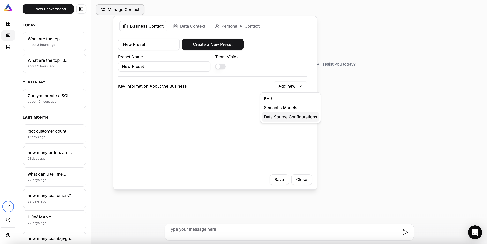

import { Steps, Step } from "nextra/components";

# Creating and Managing Context in Visuo

This guide will walk you through the process of creating and managing Business Context, Data Context, and Personal AI Context in Visuo, enhancing the accuracy and effectiveness of AI-driven data analysis.

<Note>
    These context features allow you to tailor Visuo's AI Data Analyst to your
    specific business needs, improving performance and relevance in data
    analysis tasks.
</Note>

## Why Use Context Features?

Visuo's context features offer several key benefits:

1. **Improved Accuracy**: Focus the AI on relevant data and business-specific semantics.
2. **Enhanced Speed**: Limit data scope to reduce processing time and enable faster responses.
3. **Increased Relevance**: Align AI outputs more closely with specific business needs and terminologies.
4. **Clarity**: Provide clear definitions for ambiguous data structures.

## Business Context

Business Context allows you to define specific presets for different analysis scenarios.

### Creating a New Preset

<Steps>
  <Step title="Access Business Context">
    Navigate to the "Manage Context" section and select the "Business Context" tab.

    

  </Step>

  <Step title="Create New Preset">
    Click the "Create a New Preset" button.

    

  </Step>
</Steps>

### Data Source Configuration

<Steps>
  <Step title="Define Preset Name and Visibility">
    Start by defining a name for your preset. Choose whether to make the preset visible to your team by switching the "Team Visible" toggle.

    

  </Step>

  <Step title="Add Key Information About the Business">
    Navigate to "Key Information About the Business" and add new Data Source Configurations.

    

  </Step>

  <Step title="Add New Data Source">
    Add a new data source by selecting the relevant database connections you have made before.

    
    *Placeholder: Screenshot showing adding new data source*

  </Step>

  <Step title="Select Relevant Tables">
    Select the tables that are pertinent to your business use case. You can remove irrelevant tables to streamline the data set.

    
    *Placeholder: Screenshot of table selection interface*

  </Step>

  <Step title="Review Data Source Configuration Accuracy">
    Our systems will show information about the accuracy of the data source configuration.

  </Step>
</Steps>

### Setting Up Semantic Models

Semantic Models help define relationships and contexts within your data.

<Steps>
  <Step title="Access Semantic Models Section">
    In the Business Context interface, find the Semantic Models section.

    
    *Placeholder: Screenshot of Semantic Models section*

  </Step>

<Step title="Add a New Semantic Model">
    Click the "+" button to create a new Semantic Model.
</Step>

  <Step title="Define Semantic Model Details">
    Complete the following fields:
    - Name: A unique identifier for your model (e.g., "semantic model 007")
    - Value: A short description of what the model represents (e.g., "order status according to state")
    - Description: A detailed explanation of how to use or interpret the model

    
    *Placeholder: Screenshot of Semantic Model definition*

  </Step>
</Steps>

#### Example Semantic Model

```json
{
    "Name": "semantic model 007",
    "Value": "order status according to state",
    "Description": "Classify the order status from the status column of the orders table according to the state in the customers table. The customer_id column can be used for the join."
}
```

### Setting Up KPIs

Key Performance Indicators (KPIs) are crucial metrics that help you track and measure the success of your business objectives.

<Steps>
  <Step title="Access KPI Section">
    In the Business Context interface, locate the KPIs section.

    
    *Placeholder: Screenshot of KPI section from Image 5*

  </Step>

<Step title="Add a New KPI">Click the "+" button to add a new KPI.</Step>

  <Step title="Define KPI Details">
    Fill in the following fields:
    - Name: A descriptive name for your KPI (e.g., "my first KPI")
    - Value: The metric or query to calculate the KPI (e.g., "Top 10 most sold products")
    - Description: A brief explanation of what the KPI represents

    
    *Placeholder: Screenshot of KPI definition from Image 5*

  </Step>
</Steps>

#### Example KPI

```json
{
    "Name": "Top 10 Most Sold Products",
    "Value": "SELECT product_id, COUNT(*) as items_sold FROM order_items GROUP BY product_id ORDER BY items_sold DESC LIMIT 10",
    "Description": "Identifies the top 10 products by sales volume, helping focus on popular items"
}
```

## Data Context

Data Context allows you to provide additional information about your data sources, tables, and columns.

### Adding Context to Connections

<Steps>
  <Step title="Access Data Context">
    Navigate to the "Data Context" tab in the "Manage Context" section.
  </Step>

<Step title="Select Connection">
    Choose the database connection you want to add context to.
</Step>

  <Step title="Add Connection Context">
    Provide information about the connection, such as whether it's for production, staging, or development environments.
  </Step>
</Steps>

### Adding Context to Tables

<Steps>
  <Step title="Select Table">
    Choose a table from your selected connection.
  </Step>

  <Step title="Add Table Context">
    Describe the purpose of the table and any important information about its usage or contents.
  </Step>
</Steps>

### Adding Context to Columns

<Steps>
  <Step title="Select Column">
    Choose a column from your selected table.
  </Step>

  <Step title="Add Column Context">
    Provide details about the column's data type, constraints, and business meaning.
  </Step>
</Steps>

## Personal AI Context

Personal AI Context allows you to customize the AI's behavior to your preferences.

<Steps>
  <Step title="Access Personal AI Context">
    Navigate to the "Personal AI Context" tab in the "Manage Context" section.
  </Step>

<Step title="Set Detail Level">
    Specify how detailed you want the AI's responses to be.
</Step>

<Step title="Define Tone">
    Choose the conversational style you prefer (e.g., formal, casual,
    technical).
</Step>

  <Step title="Set Output Preferences">
    Specify your preferred format for data and insights presentation (e.g., tables, charts, narrative form).
  </Step>
</Steps>

## Best Practices

To get the most out of Visuo's context features, consider these best practices:

1. **Regular Updates**: Keep your contexts up-to-date with changes in your business structure or data landscape.
2. **Collaborative Approach**: Involve stakeholders from different departments when creating contexts to ensure comprehensive coverage.
3. **Clear Documentation**: Maintain detailed notes on your context configurations for future reference.
4. **Iterative Refinement**: Regularly test and refine your contexts based on the AI's performance and user feedback.

<Warning>
    Remember to manage your contexts carefully. Incorrect configurations can
    impact the accuracy and relevance of your AI-driven analyses.
</Warning>

By following this guide, you should now be able to effectively create and manage Business Context, Data Context, and Personal AI Context in Visuo, significantly enhancing your AI-driven data analysis capabilities.
